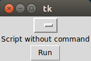

# docgui

## What is this?

This module turns your docopt command-line scripts into GUIs.
It's very straightforward to use: just replace your `__main__` section with `guify()`.
That's it.


## What does it look like?
This is made with Tkinter, so you'll have its look and feel.
To this day, I have made no work on appearance, so it's plain basic.




## How do I use it?

Let's say you have a `dummy.py` script, written with `docopt`:

```python3
'''Dummy program

Usage:
    dummy
    dummy foo
    dummy bar <a>
'''

from docopt import docopt


def main(args):
    print(args)


if __name__ == '__main__':
    args = docopt(__doc__)
    main(args)
```

Import `docgui` and replace your `__main__` section with `docgui.guify()`:

```python3
'''Dummy program

Usage:
    dummy
    dummy foo
    dummy bar <a>
'''

from docgui import guify


def main(args):
    print(args)


guify()
```

And that's it. Nothing more, nothing less.
Now, running your script will open the GUI you saw above, and clicking `Run` will
execute the selected command.
